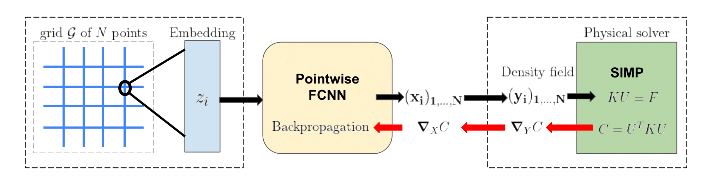

# DeepTopo

This is the code related to our Neurips publication:

[DNN-based topology optimization: spatial invariance and neural tangent kernel](https://arxiv.org/abs/2106.05710)



## Installation

See pyproject.toml to install it with poetry.

You can also pip install the requirements.

Other possibility: create a virtual environement and install the repository with pip.


## Usage

To see a demo of DNN-based topology optimisation see deeptopo/training/demo.py


## NTK

In deeptopo/ntk you can find support to compute theoretical and empirical NTK


## Citation:
If you find this work useful for your research, please consider citing:

```
@misc{dupuis2021dnnbased, 
      title={DNN-Based Topology Optimisation: Spatial Invariance and Neural Tangent Kernel}, 
      author={Benjamin Dupuis and Arthur Jacot},
      year={2021},
      eprint={2106.05710},
      archivePrefix={arXiv},
      primaryClass={stat.ML}
}
```

## Acknowledgement

The folder deeptopo/topoptim contains an implementation of the SIMP method, inspired by the paper:
```
@article{topopt88,
author = {Andreassen, Erik and Clausen, Anders and Schevenels, Mattias and Lazarov, Boyan and Sigmund, Ole},
year = {2011},
month = {11},
pages = {1-16},
title = {Efficient topology optimization in MATLAB using 88 lines of code},
volume = {43},
journal = {Structural and Multidisciplinary Optimization},
doi = {10.1007/s00158-010-0594-7}
}
```

to see a demo of this code, see the script deeptopo/topoptim/demo.py
